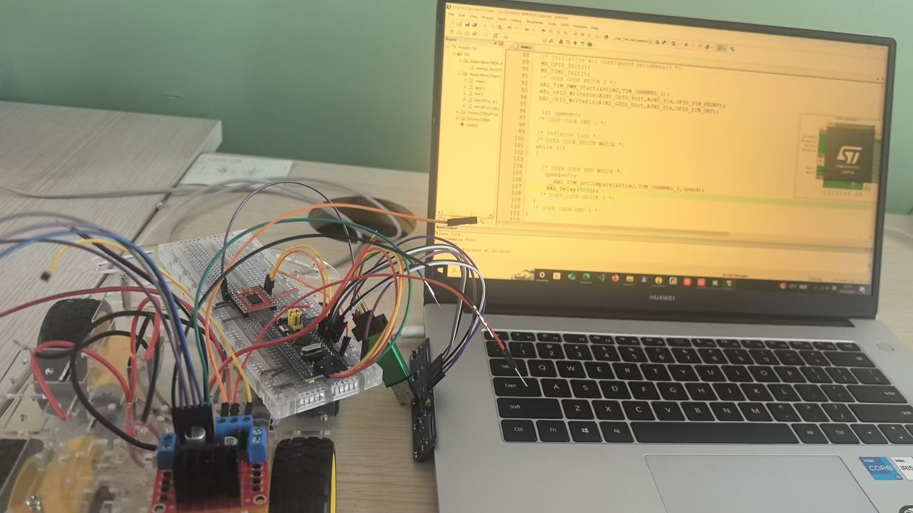
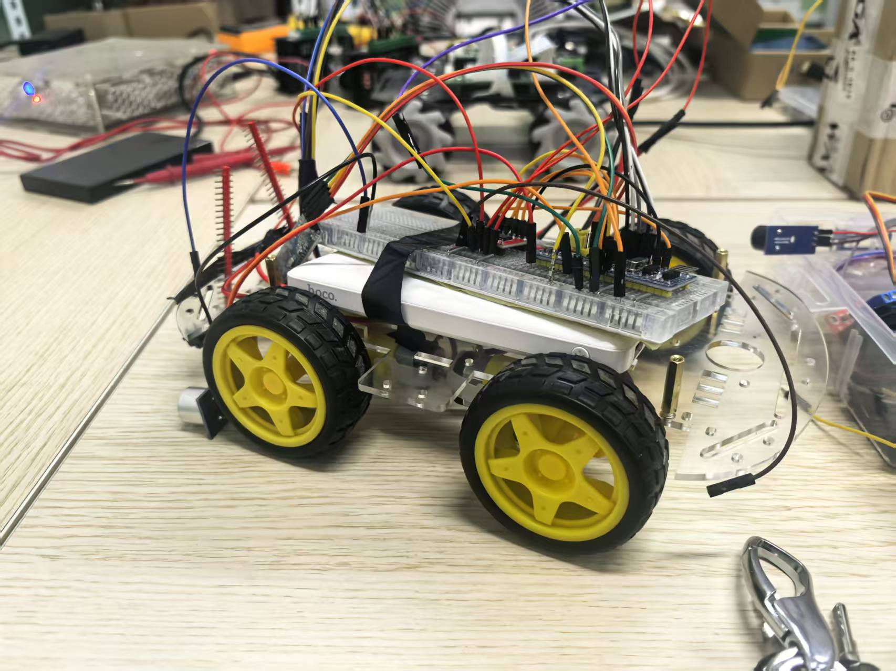
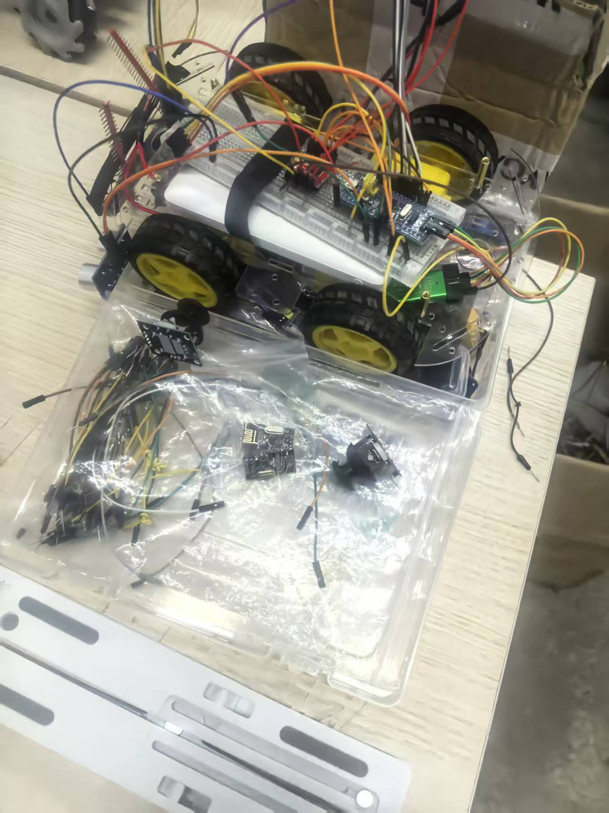

# 🚗 STM32 智能小车 — 大一项目

> 大一第一个 STM32 项目，全部代码手敲完成。
> 从零开始学 GPIO、定时器、PWM、串口、中断。

## 🎬 演示视频

[▶️ 点击播放：演示视频1](assets/06901879e92779fa5499cf2f8aaafcc3.mp4)

[▶️ 点击播放：演示视频2](assets/b48830afc0961f4f23df6b9e64aef081.mp4)

[▶️ 点击播放：演示视频3](assets/1097d779d1402ed2d957143a4aeca3c2.mp4)

## 📷 实物照片







## ⚙️ 功能

| 功能 | 实现 |
|------|------|
| 📱 **蓝牙遥控** | `E`前进 `H`后退 `L`左转 `R`右转 `S`停止 `X`旋转 |
| 🛤️ **5路循迹** | 红外传感器阵列，结构体封装，黑线识别自动纠偏 |
| 📏 **超声波避障** | HC-SR04 实时测距 |

## 📁 代码结构

```
User/
├── USART.c/h      📱 蓝牙串口指令解析
├── qudong.c/h     🔧 电机驱动（goForward/goBack/goLeft/goRight/stop/旋转/左旋/右旋/慢左）
├── xunji.c/h      🛤️ 5路循迹传感器读取 + 自动纠偏逻辑
└── bizhang.c/h    📏 超声波测距
```

## 🔩 硬件

| 模块 | 说明 |
|------|------|
| STM32F103C8T6 | 主控 |
| HC-05 | 蓝牙模块 |
| HC-SR04 | 超声波测距 |
| 5路红外传感器 | 循迹 |
| L298N | 电机驱动 |

## 🔨 打开方式

Keil MDK5 打开 `MDK-ARM/A.uvprojx` → 编译 → 烧录
